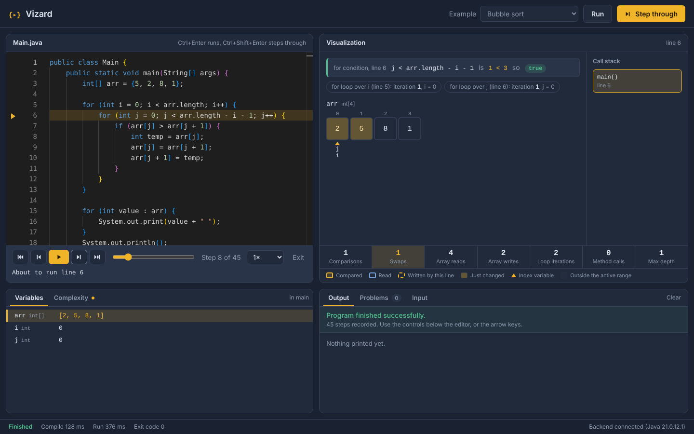
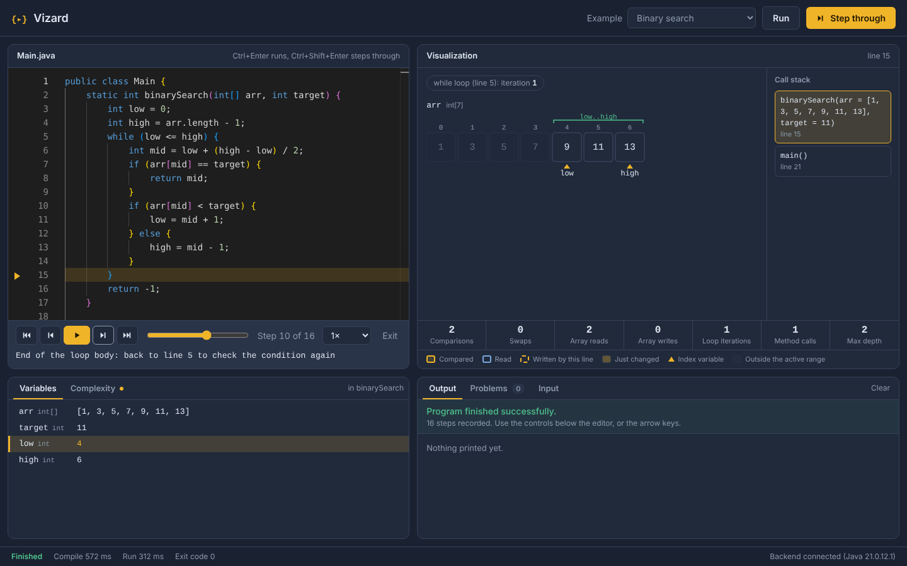
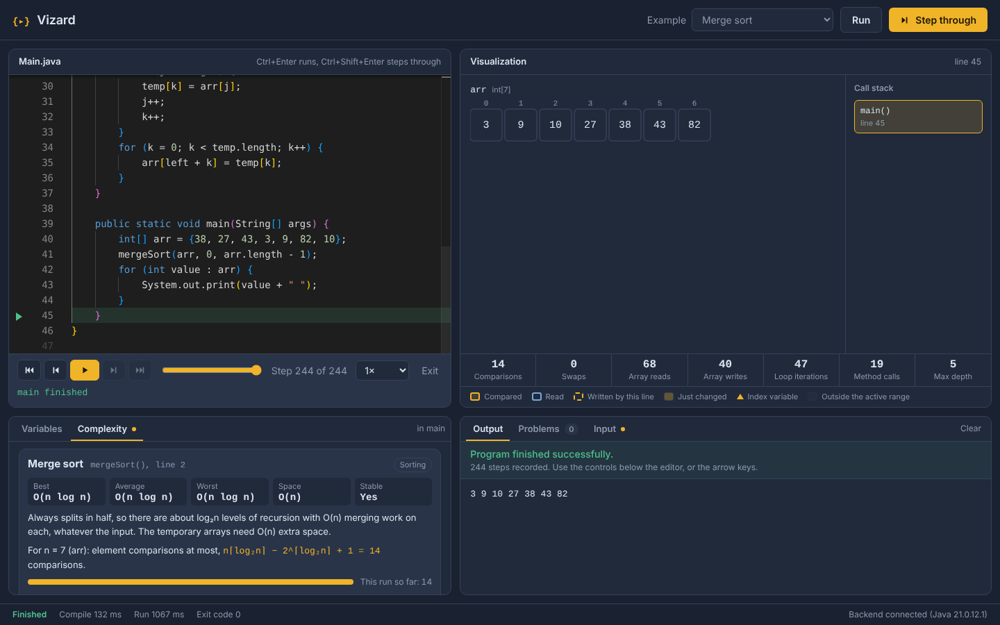
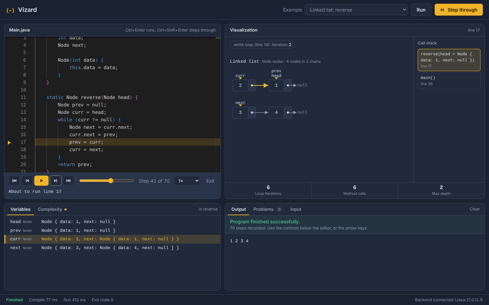
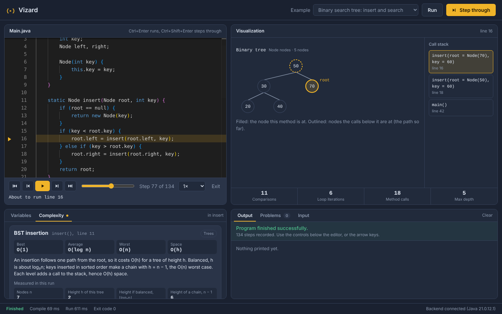
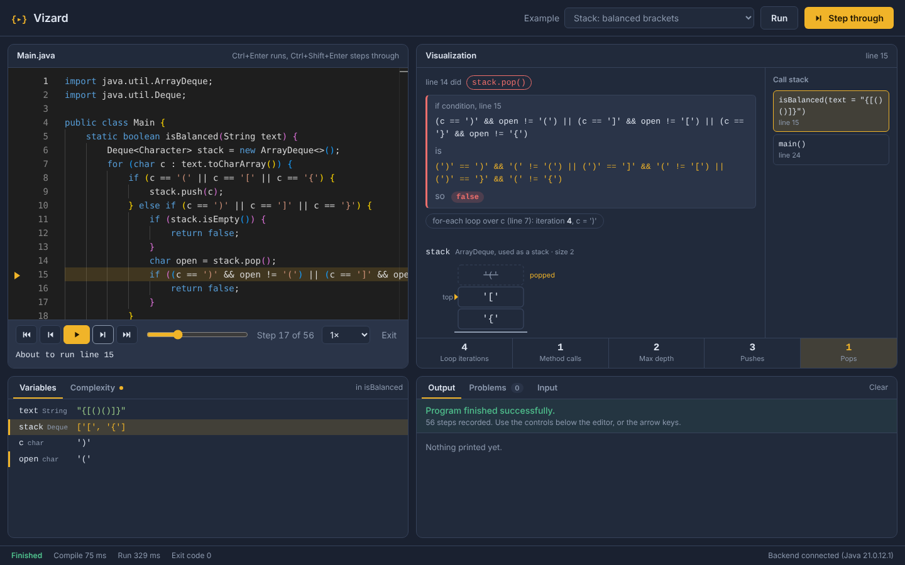

# Vizard

Interactive Java code execution, step-by-step debugging and algorithm visualization, built as a
Design and Analysis of Algorithms course project.

> Status: **Milestone 5** — step through Java forwards and backwards and *see* it run: arrays, pointers,
> conditions and loops; stacks, queues, priority queues, maps and sets; your own linked lists and binary
> trees. Live operation counts, and complexity analysis for the sorting, searching, tree and list
> algorithms taught in DAA.

## Screenshots

Bubble sort, the step that completes a swap: both cells highlighted, the Swaps counter just increased.



Binary search: cells outside `low..high` are dimmed, the step explains the jump back to the loop condition.



Merge sort finished: the Complexity tab compares the worst case for n = 7 with this run's count.



Linked list reversal half-way: the list is two chains, the link just turned around is amber, and
`curr`, `prev` and `next` label the nodes they point at.



Recursive BST insert: the node this call is at is filled, the path the recursion took is outlined,
and the Complexity tab shows the tree's measured height.



Bracket matching with a stack: the popped `(` stays one step as a ghost above the new top.



## How it works

```
Browser (Monaco editor)
   │  POST /api/execute  or  POST /api/trace   { code, stdin }
   ▼
Spring Boot
   ├─ SourceAnalyzer       JavaParser → AST, find the class with main()
   ├─ SafetyPolicy         reject files, network, threads, reflection, System.exit...
   ├─ JavaCompilerService  javax.tools compiler, in-process, annotation processing off
   ├─ LocalProcessSandbox  separate JVM: timeout, -Xmx, output cap, empty env & temp dir
   ├─ RunOutcomeClassifier success / runtime error (with line) / timeout / OOM / output flood
   └─ (trace only)
        JdiTraceSession   the sandboxed JVM starts paused and connects to Vizard's debugger (JDI);
                          a breakpoint on every line + method-exit watches record the full state:
                          call stack, locals, statics, reachable arrays/objects, output so far
        CollectionReader  ArrayList, ArrayDeque, HashMap, TreeMap, PriorityQueue... read through
                          their internal fields (nothing runs inside the program)
        CollectionCalls   breakpoints on the call instructions of lines that use a collection, so
                          each push / poll / put the program makes is recorded with its arguments
        StructureRoles    how each collection was used (an ArrayDeque fed push/pop is a stack)
        CodeModelBuilder  AST → where conditions, loops and array accesses are; which int
                          variables index which arrays
        TraceAnnotator    state + code model → per-step insight: condition values and result,
                          accessed/changed cells, swaps, pointers, loop iterations, active range,
                          and running statistics (comparisons, swaps, reads, writes, calls, depth)
        AlgorithmDetector AST → recognised algorithms (by structure, not by name), including
        StructureAlgorithms BST search / insert / delete, traversals and list reversal →
        AlgorithmCatalog  best / average / worst / space, with worst-case counts for this run's n
                          and measured facts (tree height); StructureCosts: cost of each call made
   ▼
JSON → editor highlight, Variables, Call stack, Output, playback controls
```

### Why a debugger instead of rewriting the code

Tracing uses the Java Debug Interface, the same API IntelliJ's debugger uses, rather than
inserting `trace()` calls into the source. The user's code runs unmodified, so the recorded values
are exactly what the JVM computed; there is no re-implementation of Java's scoping rules that
could disagree with the compiler. The cost is speed (about 1,500 steps per second), which is why
traces are capped. The AST from JavaParser provides the meaning on top of the state.

### How algorithms are recognised

`AlgorithmDetector` matches the defining *structure* of each algorithm in the AST; method names are
never used. For example, bubble sort = two nested loops + an `if` comparing neighbouring elements
`a[j]` and `a[j + 1]` + a swap inside that `if`. Recognisers exist for bubble, selection, insertion,
merge and quick sort and for linear and binary search. Each match records its evidence in plain words
("Compares neighbouring elements arr[j] and arr[j + 1] (line 7)"), shown in the Complexity tab.

The complexity itself is a **known-algorithm mapping** (`AlgorithmCatalog`), adjusted for details
Vizard can see: bubble sort's best case is O(n) only if it has an early-exit flag; recursive binary
search needs O(log n) space. Code that matches nothing gets no complexity claim; Vizard does not
pretend to derive the complexity of arbitrary code.

For the input of the current run (n = length of the largest array used), the catalogue also gives
the worst-case number of element comparisons, e.g. n(n−1)/2 = 6 for bubble sort on 4 elements,
shown next to the live count.

### How operations are counted

Every step carries running totals up to that step, so stepping back rewinds them:

| Counter | Counts |
|---|---|
| Comparisons | evaluated conditions that compared at least one array element (`arr[j] > arr[j + 1]`, `arr[mid] == target`); short-circuited parts are not counted |
| Swaps | two cells exchanging values, written from different lines (`a[i] = a[j]; a[j] = t;`) or a `swap()` call. Copying a temp array back in merge sort is *not* a swap |
| Array reads / writes | element accesses by lines that ran |
| Loop iterations | iterations started, in any loop |
| Method calls | calls to your methods and constructors (main not counted) |
| Max depth | deepest call stack (1 = only main) |
| Pushes / pops | stack operations (`Stack`, or a `Deque` used through `push`/`pop`) |
| Enqueues / dequeues | queue and priority-queue operations (`offer`/`add` at the rear, `poll`/`remove()` at the front) |
| Inserts / removes / lookups | `add`, `put`, `set` / `remove` / `get`, `contains`, `containsKey`, `peek` on any collection |

Comparisons also count conditions that compare a node's value field, such as `key < root.key` in a BST;
pointer checks like `root.left == null` are not comparisons. Only the counters a program uses are shown.

The counts for the examples were checked against independent implementations (for instance quick
sort on {10, 80, 30, 90, 40, 50, 70}: 13 comparisons, 5 swaps).

### How data structures are read and drawn

**Collections.** `CollectionReader` reads `ArrayList`, `LinkedList`, `ArrayDeque`, `Stack`/`Vector`,
`PriorityQueue`, `HashMap`, `LinkedHashMap`, `TreeMap`, `HashSet`, `LinkedHashSet`, `TreeSet`,
`List.of(...)` and `Arrays.asList(...)` through their internal fields, the way a debugger's variables
view does. Nothing is called inside the program (calling `toArray()` would run code in it). The
elements come out in Java's own iteration order: an `ArrayDeque` from head round its circular buffer,
a `TreeMap` by an in-order walk, a `PriorityQueue` in heap-array order.

**Operations.** Watching every method entry of `HashMap` would also catch the thousands of calls the
JDK makes internally (Scanner, string concatenation), slowing a trace ten-fold. Instead, on each line
that calls `push`, `poll`, `put`... (known from the AST), Vizard puts a breakpoint on every call
instruction, and from there catches only the method entered next. It is counted if a user line called
it directly on a collection, so `HashSet.add` calling `HashMap.put` inside is one operation, not two.
Each operation is attached to the first step recorded after it: the step where its effect is visible.

**Roles.** How a collection is drawn depends on how it was *used*, decided from all its operations:
an `ArrayDeque` that only sees `push`/`pop` is a stack (top first); fed `offer`/`poll` it is a queue;
a `LinkedList` used through `get(i)` is a list. `java.util.Stack` keeps its top last.

**Your own nodes.** A class with fields of its own type is a node: `left` + `right` → tree node;
one link (plus an optional `prev`) → linked-list node. Lists are drawn as chains, one row per chain
(a reversal in progress is two chains); trees with x = inorder position and y = depth, so a BST reads
sorted. Variables label the nodes they point at; the node the current call is at is filled and the
nodes its callers are at are outlined, which shows the path a recursion took.

| Structure | Drawn as | Highlighted each step |
|---|---|---|
| Stack | upright column, top at the top | pushed element; popped element as a ghost |
| Queue / deque | row, front → rear | enqueued element; dequeued element as a ghost |
| Priority queue | heap tree + its array | positions whose value changed |
| Map / set | key → value table / chips | new or changed entries; looked-up keys outlined |
| List / array | indexed boxes (lists of lists as rows) | as arrays |
| Linked list | `[value│•]` boxes and arrows | new nodes; links that changed (amber) |
| Binary tree | nodes and edges | current node, call path, new nodes and edges |

### How a condition's result is decided

For `if (arr[j] > arr[j + 1])` Vizard shows `5 > 2` and `true`. The values come from a small
evaluator that reads the recorded state; it never runs code, and it treats anything with side
effects (method calls, `i++`, assignments) as unknown. The true/false result is taken from **what
actually happened next**: if the next line in the same method call is inside the branch, the
condition was true. That works even for `if (isPrime(n))`, which the evaluator can't compute.
For `if`/`while` the evaluator is used first (Vizard stops exactly where those conditions are
evaluated); for a `for` header it's the other way round, because that stop happens before the
loop's update runs.

## Project structure

```
vizard/
├── backend/                        Spring Boot (Maven)
│   ├── pom.xml
│   └── src/
│       ├── main/java/com/vizard/
│       │   ├── VizardApplication.java
│       │   ├── api/                ExecutionController, GlobalExceptionHandler, dto/, dto/trace/
│       │   ├── config/             ExecutionProperties (limits)
│       │   └── execution/
│       │       ├── ExecutionService.java       pipeline shared by Run and Step through
│       │       ├── PreparedProgram.java
│       │       ├── RunOutcomeClassifier.java
│       │       ├── analysis/       SourceAnalyzer, SafetyPolicy, SourceAnalysis
│       │       ├── compile/        JavaCompilerService, CompilationResult
│       │       ├── sandbox/        ExecutionSandbox, RunningProgram, LocalProcessSandbox, ...
│       │       ├── trace/          JdiTraceSession, HeapReader, CollectionReader, CollectionCalls,
│       │       │                   SameLineLoops, TraceRunner, ...
│       │       ├── insight/        CodeModelBuilder, CodeModel, Expr, ExpressionEvaluator,
│       │       │                   TraceAnnotator, StructureRoles
│       │       └── algorithms/     AlgorithmDetector, StructureAlgorithms, AlgorithmCatalog,
│       │                           StructureCosts, StructureFacts, Algorithm, Detection
│       ├── main/java/com/vizard/examples/   ExampleCatalog
│       ├── main/resources/examples/         index.json + one .java file per example
│       ├── main/resources/application.properties
│       └── test/java/com/vizard/   execution/ExecutionServiceTest, TraceServiceTest, InsightTest,
│                                   StatisticsTest, CollectionsTest, StructureStatisticsTest,
│                                   insight/CodeModelBuilderTest, trace/NodeShapeTest,
│                                   algorithms/AlgorithmDetectorTest, StructureAlgorithmsTest,
│                                   examples/ExamplesTest
└── frontend/                       Plain HTML/CSS/JS, served by the backend
    ├── index.html
    ├── css/styles.css
    └── js/
        ├── main.js, api.js, editor.js, outputPanel.js, values.js, tabs.js
        ├── playback/        PlaybackController, PlaybackBar, describeStep
        └── visualizations/  VisualizationPanel, ArrayVisualizer (SVG), StructureVisualizer,
                             StackVisualizer, QueueVisualizer, HeapVisualizer, MapVisualizer,
                             LinkedListVisualizer, TreeVisualizer, InsightStrip, StatsBar,
                             ComplexityPanel, CallStackVisualizer, VariableVisualizer,
                             visible.js, svg.js
```

## Requirements

- **JDK 21** (a JDK, not a JRE — Vizard needs the compiler)
- **Maven 3.9+** (bundled with IntelliJ IDEA)
- Internet access in the browser (Monaco and fonts load from a CDN)

## Run

```powershell
cd backend
mvn spring-boot:run
```

Open http://localhost:18080. Run from the `backend` folder: the frontend is served from `../frontend`.

## Test

```powershell
cd backend
mvn test
```

## API

### `POST /api/execute`

```json
{ "code": "public class Main { ... }", "stdin": "optional input" }
```

Response (always HTTP 200 for anything the user's program did):

```json
{
  "status": "SUCCESS | COMPILATION_ERROR | UNSUPPORTED_FEATURE | RUNTIME_ERROR | TIMEOUT | MEMORY_LIMIT_EXCEEDED | OUTPUT_LIMIT_EXCEEDED | INVALID_REQUEST | SERVER_BUSY | INTERNAL_ERROR",
  "success": true,
  "message": "Program finished successfully.",
  "stdout": "...",
  "stderr": "",
  "exitCode": 0,
  "compileTimeMs": 310,
  "runTimeMs": 95,
  "problems": [ { "line": 3, "column": 18, "message": "';' expected", "severity": "ERROR" } ],
  "runtimeError": { "exceptionType": "java.lang.ArithmeticException", "message": "/ by zero", "line": 5 }
}
```

Fields that are null are left out of the JSON.

### `POST /api/trace`

Same request. Response:

```json
{
  "execution": { "...": "same shape as /api/execute" },
  "truncated": false,
  "maxSteps": 3000,
  "steps": [
    {
      "index": 6,
      "event": "LINE",
      "line": 9,
      "depth": 1,
      "stack": [
        { "className": "Main", "methodName": "main", "line": 9,
          "variables": [
            { "name": "arr", "type": "int[]", "argument": false,
              "value": { "kind": "ref", "type": "int[]", "display": "int[]", "ref": 57 } },
            { "name": "temp", "type": "int", "argument": false,
              "value": { "kind": "primitive", "type": "int", "value": 5, "display": "5" } }
          ] }
      ],
      "statics": [],
      "heap": {
        "57": { "id": 57, "kind": "array", "type": "int[]", "length": 4, "truncated": false,
                "elements": [ { "kind": "primitive", "type": "int", "value": 2, "display": "2" } ],
                "fields": [] }
      },
      "outputLength": 0
    }
  ]
}
```

Every step also has an `insight`:

```json
"insight": {
  "condition": { "kind": "if", "line": 6, "text": "arr[j] > arr[j + 1]", "explanation": "5 > 2", "result": true },
  "accesses":  [ { "array": "arr", "ref": 57, "index": 0, "text": "arr[j]", "write": false, "compared": true } ],
  "changes":   [ { "ref": 57, "indices": [1] } ],
  "swap":      { "ref": 57, "first": 0, "second": 1 },
  "pointers":  [ { "array": "arr", "ref": 57, "variable": "j", "index": 0 } ],
  "loops":     [ { "kind": "for", "line": 5, "variable": "j", "iteration": 1 } ]
}
```

plus `"ranges": [ { "array": "arr", "fromVariable": "low", "from": 4, "toVariable": "high", "to": 6 } ]`
and `"loopBackTo": 5` when stopped on a loop's closing brace. Each step also has running `stats`:

```json
"stats": { "steps": 8, "comparisons": 1, "swaps": 1, "arrayReads": 4, "arrayWrites": 2,
           "methodCalls": 0, "maxDepth": 1, "loopIterations": 2 }
```

The response has an `analysis`:

```json
"analysis": {
  "input": { "name": "arr", "n": 4 },
  "algorithms": [ {
    "id": "bubble-sort", "name": "Bubble sort", "category": "Sorting", "method": "main", "line": 2,
    "evidence": [ "Two nested loops in main().", "Compares neighbouring elements arr[j] and arr[j + 1] (line 7)." ],
    "complexity": { "best": "O(n²)", "average": "O(n²)", "worst": "O(n²)", "space": "O(1)", "stable": true, "note": "..." },
    "bound": { "metric": "comparisons", "description": "element comparisons (exactly, for any input)",
               "formula": "n(n−1)/2", "value": 6, "scope": "program" }
  } ]
}
```

Collections appear in the heap as `"kind": "collection"` with `elements` (or `entries` for maps),
a `role` and, for stacks, `top` (`"first"` or `"last"`). User node objects carry a `role`
(`"list-node"` / `"tree-node"`) and their `links` (`["next"]`, `["left", "right"]`). Each step lists the
collection calls made since the previous step:

```json
"operations": [ { "ref": 60, "type": "ArrayDeque", "method": "push", "args": [ { "display": "'('" } ],
                  "line": 9, "kind": "push" } ]
```

and `analysis.structures` gives each collection's calls with their cost:

```json
"structures": [ { "variable": "count", "type": "HashMap", "role": "map",
                  "operations": [ { "method": "put", "count": 6, "cost": "O(1) average" } ], "note": "..." } ]
```

Tree and list algorithms add `measures`, e.g. `{ "label": "Height h of this tree", "value": "2" }`.

Events: `CALL` (first line of a method just called), `LINE` (line about to run), `RETURN`
(method returning; `returnValue` present unless void), `EXCEPTION` (uncaught; last step).
`outputLength` is how many characters of `execution.stdout` existed at that step.

### `GET /api/examples`

The Example menu: `[{ "id", "title", "group", "code", "stdin"?, "algorithms" }]`, read from
`backend/src/main/resources/examples/`. To add an example, add a `.java` file there and a line in
`index.json`; `ExamplesTest` then checks it compiles, traces and is recognised as exactly `algorithms`.

### `GET /api/health`

`{ "status": "UP", "javaVersion": "21..." }`

## Execution limits

Configured in `application.properties`:

| Property | Default | Meaning |
|---|---|---|
| `vizard.execution.timeout-ms` | 5000 | Wall-clock limit per run |
| `vizard.execution.max-heap-mb` | 128 | `-Xmx` of the program's JVM |
| `vizard.execution.max-output-bytes` | 65536 | stdout cap; the program is stopped when exceeded |
| `vizard.execution.max-concurrent-runs` | 2 | Simultaneous runs and traces |
| `vizard.execution.trace-timeout-ms` | 15000 | Wall-clock limit for a traced run |
| `vizard.execution.max-trace-steps` | 3000 | Steps recorded; the rest of the program then runs untraced |

## Supported Java (Milestone 1)

One source file with a `public static void main(String[] args)`; any number of classes and methods.
Imports allowed from `java.util`, `java.util.function`, `java.util.stream`, `java.math`.
Not allowed: file I/O, network, processes, threads, reflection, `System.exit`, native methods.

## Tracing limitations

- Loops written on one line (`for (...) sum += i;`) are stepped through every iteration (an extra
  breakpoint is placed on the loop's jump-back target), but they get no iteration counter.
- When a `for` loop ends, its variable is already out of scope, so the final check shows as
  `j < 3` is `false` rather than `3 < 3`.
- Collections are read from JDK 21's internal fields. Other collection classes (and wrappers such as
  `Collections.unmodifiableList`) show their type name only. At most 100 elements are shown.
- Only calls your code makes directly on a collection are counted; a call made inside a library method
  (`Collections.sort(list)`) is not. `remove()` on a `PriorityQueue` isn't counted (it lives in a
  superclass).
- Trees show up to 63 nodes; lists 12 nodes per row. Node classes linking to a list of nodes (graph
  nodes) are drawn from Milestone 6.
- Algorithm recognition covers the textbook shapes of fifteen algorithms. Unusual implementations
  (e.g. a three-way quick sort, or merge sort without a separate merge loop) may not be recognised,
  in which case no complexity is claimed. Counts stay exact either way.
- Comparisons are counted per evaluated condition, so `if (a[i] > x && a[i] < y)` counts once.
- Pointers are detected from how variables are used (`arr[j]`, `mid = low + (high - low) / 2`,
  `i < arr.length`); an index variable used in other ways may not get a caret.
- At most 3000 steps are recorded; arrays show their first 100 elements and each step keeps up to 150 objects.
- The first step may be a class's static setup (`static int count = 0;`), which Java really runs before `main`.

## Security model and known limitations

User code never runs inside the Spring Boot process. It runs in a separate JVM with a timeout,
heap cap, output cap, one visible CPU, an empty environment and a throwaway working directory.
The AST-based `SafetyPolicy` rejects dangerous APIs before compiling.

This is a **development sandbox for local use**, not a hardened one: on Windows it cannot block
file or network access at the OS level, and native (off-heap) memory is not capped. The
`ExecutionSandbox` interface exists so a container-based sandbox (Docker with `--network none`,
read-only filesystem, cgroup CPU/memory limits) can replace `LocalProcessSandbox` without other changes.
Do not expose this server to the internet.
